# Hammer — TryHackMe Web Application Penetration Test

> **Platform:** TryHackMe  
> **Room:** Hammer  
> **Category:** Web Application Security / Authentication  
> **Difficulty:** Medium  
> **Focus:** Web Enumeration, Authentication, Password Reset, Rate-Limit Bypass, JWT, Privilege Escalation, Command Execution

---

## Disclaimer

This write-up documents testing performed against an intentionally vulnerable machine provided by TryHackMe for educational purposes.

All exploitation described here was performed within the authorized lab environment.

---

# Overview

Hammer is a web application security assessment focused heavily on authentication and session management.

The assessment began with network and web enumeration and progressed through multiple weaknesses in the application's authentication and authorization mechanisms.

The final attack chain involved:

```text
Network Enumeration
        ↓
Web Enumeration
        ↓
Information Disclosure
        ↓
Password Reset Enumeration
        ↓
Rate-Limit Bypass via X-Forwarded-For
        ↓
4-Digit Recovery Code Brute Force
        ↓
Password Reset
        ↓
Authenticated Dashboard
        ↓
JWT Discovery
        ↓
JWT Signing Key Disclosure
        ↓
JWT Role Manipulation
        ↓
Administrative Access
        ↓
Command Execution
        ↓
Flag
```

---

# 1. Reconnaissance

## 1.1 Initial Port Scan

The target initially did not expose a standard web service on the default ports, so I performed a full TCP port scan.

```bash
nmap -p- -T4 10.48.133.23
```

The scan identified:

```text
22/tcp    open    ssh
1337/tcp  open    waste
```

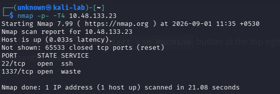

Port `1337` was therefore identified as the primary web application entry point.

---

## 1.2 Service Enumeration

I then performed service/version detection and Nmap's default enumeration scripts.

```bash
nmap -sV -sC -p 22,1337 -oN nmap_scan.txt 10.48.133.23
```

The relevant results were:

```text
22/tcp    open  ssh    OpenSSH 8.2p1 Ubuntu 4ubuntu0.11

1337/tcp  open  http   Apache httpd 2.4.41 (Ubuntu)
```

Nmap also identified a PHP session cookie:

```text
PHPSESSID
```

with the `HttpOnly` flag not set.

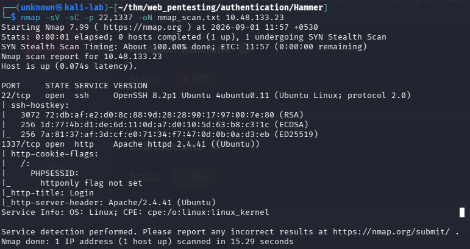

### Initial observations

* SSH exposed on port 22.
* Apache 2.4.41 exposed on port 1337.
* The application uses PHP sessions.
* `PHPSESSID` did not have the `HttpOnly` cookie flag.

---

# 2. Web Directory Enumeration

The web application presented a login page.

I used FFUF to enumerate accessible directories and files:

```bash
ffuf -u 'http://10.48.133.23:1337/FUZZ' \
     -w /usr/share/wordlists/dirb/big.txt \
     -o ffuf_direc-enum.txt \
     -of md
```

Interesting results included:

```text
javascript       [301]
phpmyadmin       [301]
vendor           [301]
```

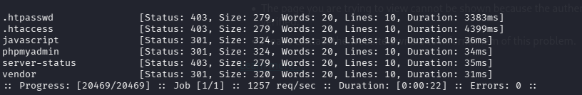

The `/vendor/` directory was particularly interesting because it was directly browsable.

---

# 3. Composer Dependency Disclosure

Browsing:

```text
/vendor/
```

revealed a directory listing containing:

```text
autoload.php
composer/
firebase/
```

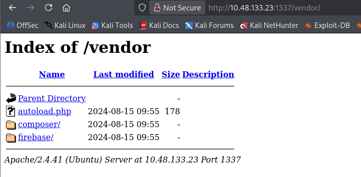

The presence of:

```text
/vendor/firebase/php-jwt/
```

indicated that the application had the Firebase PHP-JWT library installed.

I then inspected:

```text
/vendor/composer/installed.json
```

because Composer's `installed.json` contains metadata about installed packages.

The file disclosed:

```text
Package: firebase/php-jwt
Version: v6.10.0
```

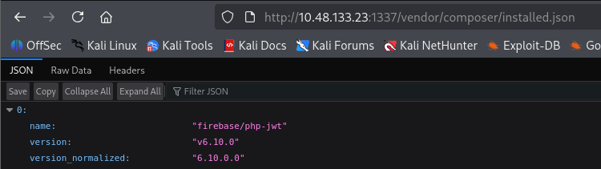

### Finding

**Exposed Composer dependency information**

The application exposed package metadata, including the exact installed version of `firebase/php-jwt`.

This provided useful information about the application's technology stack and potential JWT implementation.

> Note: discovering the library did not, by itself, prove that the application was vulnerable or that the library was necessarily being used for authentication.

---

# 4. phpMyAdmin Enumeration

The `/phpmyadmin/` endpoint was also accessible.

I submitted a test login using:

```text
admin:admin
```

The application returned a verbose MySQL error:

```text
Cannot log in to the MySQL server

mysqli_real_connect():
(HY000/1045):
Access denied for user 'admin'@'localhost'
(using password: YES)
```

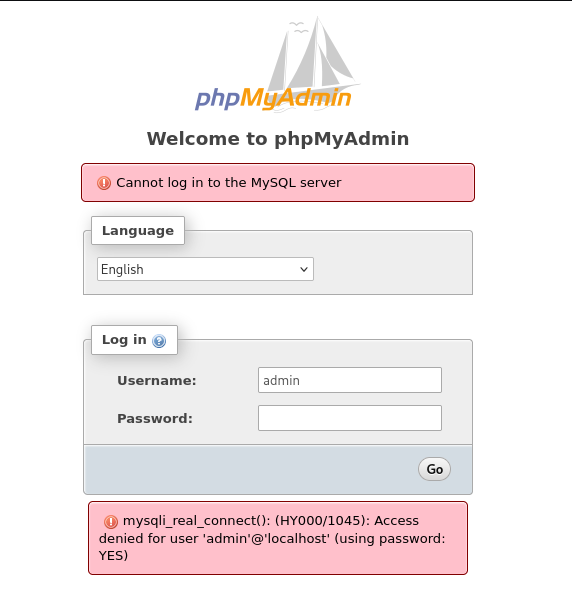

### Information disclosed

The error revealed:

* MySQL is being used.
* The connection uses `mysqli`.
* The attempted database username was `admin`.
* The database connection was to `localhost`.

I also inspected the phpMyAdmin page source and identified:

```text
PMA_VERSION: 4.9.5deb2
auth_type: cookie
logged_in: false
user: root
```

The `root` value did not represent a known password or authenticated access.

This was treated as reconnaissance information rather than assuming database access.

---

# 5. Developer Note Discovery

I returned to the main application and inspected the response source.

The login page contained an HTML comment:

```html
<!-- Dev Note: Directory naming convention must be hmr_DIRECTORY_NAME -->
```

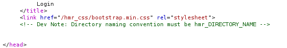

This provided a specific clue for further enumeration.

Rather than continuing with completely blind directory discovery, I used the naming convention directly.

---

# 6. Targeted `hmr_` Enumeration

I used FFUF against:

```text
/hmr_FUZZ
```

```bash
ffuf -u http://10.48.133.21:1337/hmr_FUZZ \
     -w /usr/share/wordlists/dirb/big.txt
```

The scan identified:

```text
css
images
js
logs
```

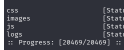

The `hmr_images` directory contained an image named:

```text
hammer.webp
```

The more interesting discovery was:

```text
hmr_logs
```

---

# 7. Exposed Application Logs

I accessed:

```text
/hmr_logs/error.logs
```

The log contained several Apache/application errors.

One particularly useful entry was:

```text
user tester@hammer.thm:
authentication failure for "/restricted-area":
Password Mismatch
```

Another entry referenced:

```text
tester@hammer.thm
```

and:

```text
/admin-login
```

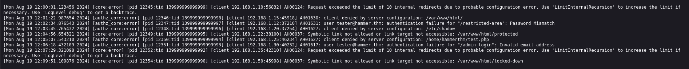

This provided a potential username/email address:

```text
tester@hammer.thm
```

I then investigated the password-reset functionality using this information.

---

# 8. Password Reset Enumeration

The application exposed:

```text
/reset_password.php
```

Submitting an unrecognized email resulted in:

```text
Invalid email address!
```

However, submitting:

```text
tester@hammer.thm
```

produced a different response:

```text
Enter Recovery Code
```

The application then requested a:

```text
4-Digit Code
```

and displayed a 180-second countdown.

This demonstrated that the password-reset functionality behaved differently for the discovered account.

---

# 9. Testing the Recovery Timer

The recovery form contained a hidden parameter:

```text
s
```

The JavaScript used this value for the displayed countdown.

I tested whether this could be manipulated by changing the submitted value.

For example:

```text
recovery_code=1234&s=9000
```

The application then displayed:

```text
You can enter your code in 9000 seconds.
```

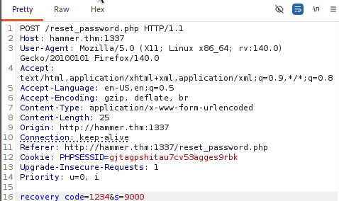

Initially, this appeared potentially interesting.

However, further testing showed that changing `s` only affected the client-side countdown.

After the real server-side recovery window expired, the application returned:

```text
Time elapsed. Please try again later.
```

Therefore:

> **The `s` parameter did not provide a server-side recovery timeout bypass.**

This was treated as a tested hypothesis rather than a successful vulnerability.

---

# 10. Rate-Limit Analysis

The password-reset responses contained a header:

```http
Rate-Limit-Pending: X
```

This indicated that the application implemented rate limiting around the recovery-code process.

I investigated whether the rate limit was tied to the client IP.

I tested the request with:

```http
X-Forwarded-For: 127.0.0.1
```

The rate-limit state changed.

I then tested different `X-Forwarded-For` values and observed that each new value received a separate rate-limit bucket.

Reusing the same value restored its previous counter.

This demonstrated that the application was trusting a client-controlled `X-Forwarded-For` header when determining the rate-limit identity.

---

# 11. Rate-Limit Bypass

The application therefore effectively behaved like:

```text
Client
   |
   | X-Forwarded-For: A
   ↓
Rate-limit bucket A

Client
   |
   | X-Forwarded-For: B
   ↓
Rate-limit bucket B
```

Instead of reliably identifying the real client, the application trusted attacker-controlled input.

This weakened the protection around the 4-digit recovery code.

### Security impact

The recovery code had only:

```text
0000 - 9999
```

possible values.

Because the rate-limit protection could be bypassed by changing the supplied IP identity, the recovery code became practical to enumerate within the server-side recovery window.

---

# 12. Recovery Code Brute Force

I automated testing of the 4-digit recovery code using Python and concurrent requests.

The script maintained the same password-reset session while varying the `X-Forwarded-For` value.

The code space was:

```text
0000
0001
0002
...
9999
```

The relevant request structure was:

```http
POST /reset_password.php

X-Forwarded-For: <controlled IP>

Cookie: PHPSESSID=<reset session>

recovery_code=<4-digit-code>&s=<remaining-time>
```

The automation identified the valid recovery code.

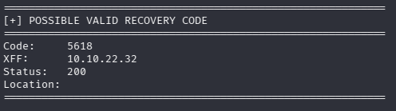

---

# 13. Password Reset

The recovered code allowed the password-reset process to proceed to the password-change stage.

I supplied a new password and successfully completed the reset process.

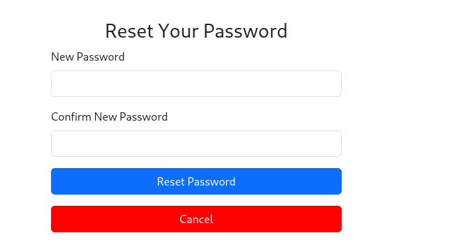

This resulted in authenticated access to the application's dashboard.

---

# 14. Authenticated Dashboard

After authentication, the application presented a dashboard containing the flag and a command execution interface.

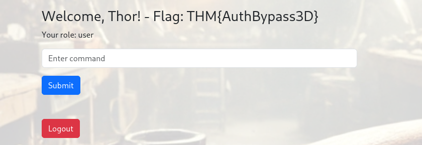

Initially, the session terminated unexpectedly.

I inspected the request in Burp Suite and noticed the following cookie value:

```text
persistentSession=no
```

I tested changing this value to:

```text
persistentSession=yes
```

and was able to maintain the authenticated session.

---

# 15. Command Execution

The dashboard contained a command execution functionality.

The command interface appeared restricted, and normal commands I tested were not accepted.

However:

```bash
ls
```

was accepted.

The response revealed:

```text
188ade1.key
composer.json
config.php
dashboard.php
execute_command.php
hmr_css
hmr_images
hmr_js
hmr_logs
index.php
logout.php
reset_password.php
vendor
```

This provided direct visibility into application files.

---

# 16. JWT Key Disclosure

One file immediately stood out:

```text
188ade1.key
```

The file was accessible through the application and could be downloaded.

At the same time, authenticated requests contained a JWT.

I inspected the JWT and its structure and then compared it with the exposed key.

The key was used to work with the application's JWT signing process.

This transformed the earlier `/vendor/firebase/php-jwt/` discovery from simple dependency disclosure into a confirmed part of the application's authentication mechanism.

---

# 17. JWT Analysis

The JWT was inspected using:

[JWT.io](https://jwt.io/)

A JWT typically consists of:

```text
HEADER.PAYLOAD.SIGNATURE
```

The header and payload are encoded rather than encrypted.

The signing key is used to validate the integrity of the token.

The application's exposed key allowed the JWT to be re-signed after modifying its claims.

---

# 18. JWT Role Manipulation

The JWT contained authorization-related information.

I modified the role claim from a normal user role to:

```json
"role": "admin"
```

The modified token was then re-signed using the exposed key.

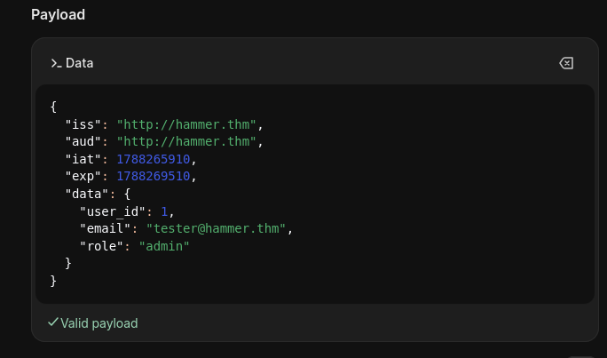

The modified JWT was supplied to the application through Burp Suite Repeater.

The application accepted the forged token and granted administrative functionality.

### Result

This demonstrated an authorization bypass caused by exposure of the JWT signing secret.

An attacker who obtains the secret can create tokens that the application considers legitimately signed.

---

# 19. Administrative Command Execution

With the forged administrative JWT, I was able to access functionality that was not available with the original privileges.

The command execution request was captured in Burp Suite Repeater.

Example:

```json
{
  "command": "cat /home/ubuntu/flag.txt"
}
```

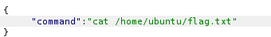

The server executed the command and returned the contents of the flag file.

---

# 20. Flag

The final response contained the room flag.

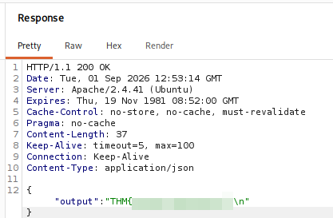

---

# Vulnerability Summary

| Finding | Description | Impact |
| --- | --- | --- |
| Directory Listing | `/vendor/` and related directories exposed internal files | Information disclosure |
| Composer Dependency Disclosure | `firebase/php-jwt v6.10.0` exposed | Technology/version disclosure |
| phpMyAdmin Exposure | phpMyAdmin interface publicly accessible | Increased attack surface |
| Verbose Database Errors | MySQL authentication details disclosed | Information disclosure |
| Developer Note Disclosure | HTML comment revealed `hmr_` naming convention | Improved attacker enumeration |
| Log Exposure | Application/server logs publicly accessible | Information disclosure |
| Account Enumeration | Password reset differentiated recognized email addresses | Account discovery |
| Client-Controlled Timer | `s` modified the displayed countdown | Client-side trust issue; server expiry remained enforced |
| Rate-Limit Bypass | `X-Forwarded-For` influenced rate-limit identity | Enabled recovery-code brute force |
| Weak Recovery Code | Four-digit recovery code | Small search space |
| JWT Secret Disclosure | JWT signing key exposed as a web-accessible file | Token forgery |
| JWT Authorization Bypass | Modified role claim accepted after re-signing | Privilege escalation |
| Command Execution | Administrative functionality allowed command execution | Full application compromise |

---

# Attack Chain

The complete exploitation path can be summarized as:

```text
1. Discover web service on port 1337
                    ↓
2. Enumerate web directories with FFUF
                    ↓
3. Discover exposed /vendor/
                    ↓
4. Identify firebase/php-jwt v6.10.0
                    ↓
5. Discover developer note
                    ↓
6. Enumerate /hmr_FUZZ
                    ↓
7. Discover exposed logs
                    ↓
8. Obtain tester@hammer.thm
                    ↓
9. Enumerate password-reset functionality
                    ↓
10. Identify 4-digit recovery code
                    ↓
11. Discover X-Forwarded-For rate-limit bypass
                    ↓
12. Enumerate recovery code
                    ↓
13. Reset password
                    ↓
14. Authenticate to dashboard
                    ↓
15. Maintain session using persistentSession behavior
                    ↓
16. Execute ls
                    ↓
17. Discover 188ade1.key
                    ↓
18. Obtain JWT signing key
                    ↓
19. Modify JWT role to admin
                    ↓
20. Re-sign JWT
                    ↓
21. Obtain administrative access
                    ↓
22. Execute command
                    ↓
23. Read flag
```

---

# Key Lessons

## 1. Enumeration is more than directory discovery

The most useful discoveries came from following clues:

```text
Developer comment
        ↓
hmr_ naming convention
        ↓
hmr_logs
```

Rather than relying only on large wordlists, application-specific clues can dramatically improve enumeration.

---

## 2. Client-side controls should never be trusted

The `s` parameter initially appeared to control the recovery timeout.

Changing it modified the browser's countdown, but the server still enforced its own expiry.

This demonstrated why client-side controls must always be validated server-side.

---

## 3. Rate limiting must be based on trustworthy information

The application trusted:

```http
X-Forwarded-For
```

when determining the rate-limit identity.

Because this header could be supplied by the attacker, changing it created a new rate-limit bucket.

This effectively weakened the protection around the recovery-code mechanism.

---

## 4. Secrets should never be web-accessible

The exposed:

```text
188ade1.key
```

was especially significant because it allowed manipulation of the application's JWT signing process.

A signing secret must be treated as sensitive application configuration and should never be stored in a publicly accessible web directory.

---

## 5. JWT claims must not be trusted simply because the token is valid

The application accepted a token with a modified authorization role after it was re-signed using the exposed key.

This demonstrates that:

```text
Valid signature
        ≠
Legitimate authorization decision
```

The signing secret itself must remain protected, and authorization decisions should be designed carefully.

---

# Tools Used

* Nmap
* FFUF
* Burp Suite
* Python
* JWT.io
* curl
* Linux/Kali Linux

---

# References

* [JWT.io](https://jwt.io/)
* [TryHackMe](https://tryhackme.com/)
* [Firebase PHP-JWT](https://github.com/firebase/php-jwt)

---

# Conclusion

The Hammer assessment demonstrated how multiple seemingly minor weaknesses can be chained into full application compromise.

The most significant chain was:

```text
Information Disclosure
        +
Account Enumeration
        +
Rate-Limit Bypass
        +
Weak Recovery Code
        ↓
Account Takeover
        ↓
JWT Secret Disclosure
        ↓
JWT Forgery
        ↓
Privilege Escalation
        ↓
Command Execution
```

The assessment reinforced the importance of treating authentication as a complete system rather than testing individual components in isolation.

A secure implementation would require:

* Strict server-side validation of password-reset state.
* Rate limiting based on a trustworthy source of client identity.
* Protection against client-controlled forwarding headers.
* Strong recovery-code controls.
* Removal of sensitive files from web-accessible directories.
* Secure storage of JWT signing secrets.
* Proper authorization validation.
* Removal of verbose errors, logs, and development comments from production deployments.
